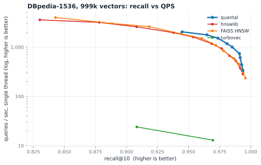
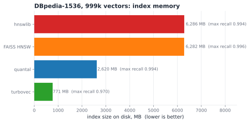
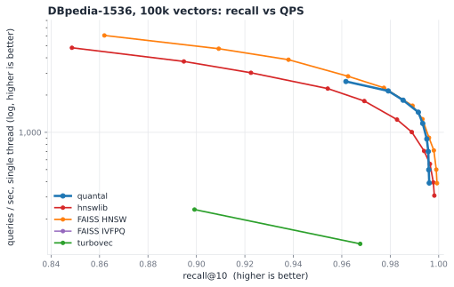

# quantal

[](https://pypi.org/project/quantaldb/)
[](https://github.com/PaytonWebber/quantal/actions/workflows/ci.yml)
[](LICENSE)

quantal is an embedded vector index that combines a navigable graph with
quantized codes. A 1-bit SimHash graph routes each query to a few hundred
candidates, 3-bit TurboQuant codes rerank that pool, and an exact pass settles
the final order. So search is sub-linear (roughly O(log n), not a full scan),
the index stores compact quantized codes instead of full-precision vectors, and
the final ranking is exact. The short version: HNSW-class sub-linear search at
quantizer-class memory, with exact final scoring.

It is a library you link, not a server you run (think SQLite, not Pinecone): a
Zig core with a C ABI, Python bindings, and drop-in LangChain, LlamaIndex, and
LangGraph stores. The routing graph is
[HNSW](https://arxiv.org/abs/1603.09320); the quantization is Google Research's
[TurboQuant](https://arxiv.org/abs/2504.19874).

## When to use quantal

quantal sits between a flat quantizer and a full-precision graph: sub-linear
search like the graph, compact quantized storage like the quantizer, and an
exact final pass that neither the flat quantizer's approximate scores nor a
graph's reached-pool distances give you for free.

|                 | quantal                        | flat quantizer (turbovec) | full-precision graph (hnswlib) |
|-----------------|--------------------------------|---------------------------|--------------------------------|
| Per-query work  | sub-linear (graph routing)     | linear scan, O(n)         | sub-linear (graph routing)     |
| Index memory    | codes + int8/fp32 rerank store | smallest (codes only)     | largest (fp32 held in graph)   |
| Final ranking   | exact (fp32/int8 rerank)       | approximate (quantized)   | exact (fp32)                   |

Reach for **quantal** with high-dimensional embeddings (384-3072) when you want
search that stays fast as the corpus grows and a final ordering settled exactly.
Reach for a **flat quantizer** when absolute minimum memory is the priority and
a per-query scan is acceptable. Reach for a **full-precision graph** when you can
hold fp32 vectors in RAM and want to push peak QPS.

## Results

quantal measured against the recognized baselines on the
[ann-benchmarks](https://github.com/erikbern/ann-benchmarks) protocol: hnswlib
and FAISS-HNSW (the graph state of the art for high-recall ANN), and turbovec
and FAISS-IVFPQ (flat quantizers). Same machine (a Ryzen 7640U laptop), cosine
via L2-normalized inner product for every index, recall@10 against an exact
search, QPS measured single-thread one query at a time. Harness:
[`benchmarks/ann_frontier.py`](benchmarks/ann_frontier.py). recall@10 is the
average fraction of the true top-10 neighbors returned; matched recall means the
speed comparison is made at the same result quality.

### High-dimensional embeddings (DBpedia, text-embedding-3-large, d=1536)

This is what quantal is built for. At 1M vectors it holds the recall/QPS
frontier above both graph baselines across the practical high-recall band, at a
fraction of their memory:



At matched recall, single thread:

| recall@10 | quantal  | hnswlib | FAISS-HNSW |
|-----------|----------|---------|------------|
| ~0.95     | 1770 QPS | 1606    | 1502       |
| ~0.975    | 1174 QPS | 931     | 841        |
| ~0.99     | 738 QPS  | 372     | 453        |

The memory gap is the structural advantage: quantal stores 3-bit codes plus an
int8 rerank store instead of full-precision vectors in the graph.



At 1M × 1536 the fp32 graphs hold ~6.3 GB; quantal's index is ~2.6 GB, 2.4×
leaner, at higher QPS. The graphs do reach the extreme tail (recall 0.996+) that
quantal does not; for the 0.95-0.99 band most applications target, quantal is on
top. The 100k frontier has the same shape:



The flat quantizers anchor the low-memory corner and pay for it: at 1M,
turbovec's linear scan drops to ~13-24 QPS, and FAISS-IVFPQ's compression caps
recall near 0.49 at this dimensionality.

### Low-dimensional data (GloVe-100): the honest weak case

quantal targets the 384-3072 range, and below it the picture flips. On GloVe-100
(d=100, 1.2M vectors) the graphs win the frontier outright: at matched ~0.84
recall, hnswlib does about 4000 QPS to quantal's about 1700, and there is no
memory advantage either (601 vs 649 MB) because fp32 vectors are small at low
dimension. On low-dimensional data a full-precision graph is the better tool;
auto-widened routing codes narrow the gap but do not close it.


Full methodology, raw logs, and the regeneration scripts
([`benchmarks/ann_frontier.py`](benchmarks/ann_frontier.py),
[`benchmarks/plot_frontier.py`](benchmarks/plot_frontier.py)) are in
[benchmarks/RESULTS.md](benchmarks/RESULTS.md).

## Install

```bash
pip install quantaldb
```

The package is `quantaldb`; the import is `quantal`:

```python
from quantal import Index
```

Wheels bundle prebuilt libraries for the common embedding dimensions
(256/384/512/768/1024/1536/3072) on Linux, macOS (Apple Silicon), and Windows.
For other dimensions, install from a source checkout with
[Zig](https://ziglang.org) 0.16 on your PATH (`pip install -e python`) and the
right library is built on first use.

## Usage

Python:

```python
import numpy as np
from quantal import Index

index = Index(dim=768)
ids = index.add(vectors)                 # (n, 768) float32, auto-assigned ids
hits = index.search(query, k=10)         # -> [(id, score), ...], cosine
index.save("docs.tq")
```

Zig:

```zig
const quantal = @import("quantal");
var index = try quantal.Index(768, 16, 768).init(allocator, 200, 42);
```

Drop-in framework stores:

```python
from quantal.langchain import QuantalVectorStore        # swap for FAISS/InMemory
from quantal.llama_index import QuantalVectorStore
from quantal.langgraph_store import QuantalStore        # agent memory
```

## How it works

1. **Route (1-bit).** Each vector is preconditioned with a random rotation and
   reduced to a sign-bit (SimHash) code. An HNSW-style graph navigates these by
   Hamming distance. This is cheap and enough to reach the right neighborhood.
2. **Rerank (3-bit).** Candidates are scored with 3-bit TurboQuant codes via a
   lookup-table kernel, with a per-vector scalar that keeps the inner-product
   estimate unbiased.
3. **Exact.** The top of that pool is rescored with the stored vectors (fp32 or
   int8), so quantization noise can't reorder the final candidate pool.

Queries are allocation-free: the search path takes a preallocated context and
never touches the allocator.

## Building (Zig)

```bash
zig build test                              # run the test suite
zig build bench -Doptimize=ReleaseFast -- synthetic --n 100000
zig build -Doptimize=ReleaseFast -Dc-dim=768   # build the C library + binaries
```

## Status

Research-grade and benchmarked on a single laptop; numbers should be taken as
directional, not a leaderboard. The Zig core and C ABI are tested in CI on
Linux, macOS, and Windows; the Python package and framework wrappers are tested
on Linux and macOS, with wheel smoke tests on every published platform. Wheels
are published to PyPI as `quantaldb`; a Rust crate is not published yet.

## How this was built

The research direction, architecture, and benchmarking are human. The
implementation (the Zig core, the Python bindings, the framework wrappers) was
written with heavy AI assistance. Every number in this README was actually
measured, and the generated code was reviewed and tested.

## References

The methods quantal builds on:

- **TurboQuant**: A. Zandieh, M. Daliri, M. Hadian, V. Mirrokni. *TurboQuant:
  Online Vector Quantization with Near-optimal Distortion Rate*, 2025.
  [arXiv:2504.19874](https://arxiv.org/abs/2504.19874), the random rotation,
  Lloyd-Max scalar quantization, and unbiased inner-product correction.
- **QJL**: A. Zandieh, M. Daliri, I. Han. *QJL: 1-Bit Quantized JL Transform
  for KV Cache Quantization with Zero Overhead*, 2024.
  [arXiv:2406.03482](https://arxiv.org/abs/2406.03482), the unbiased 1-bit
  transform behind the inner-product stage.
- **HNSW**: Yu. A. Malkov, D. A. Yashunin. *Efficient and Robust Approximate
  Nearest Neighbor Search using Hierarchical Navigable Small World Graphs*,
  2016. [arXiv:1603.09320](https://arxiv.org/abs/1603.09320), the routing graph.
- **SimHash**: M. Charikar. *Similarity Estimation Techniques from Rounding
  Algorithms*, STOC 2002. Sign-random-projection codes and multi-bit routing.
- **Johnson-Lindenstrauss lemma**: W. B. Johnson, J. Lindenstrauss, 1984.
  random projection preserves angles, the basis for sub-`dim` routing codes.
- **Lloyd-Max quantization**: S. P. Lloyd, *Least Squares Quantization in PCM*
  (1982); J. Max, *Quantizing for Minimum Distortion* (1960). The scalar codebook.

Datasets and baseline:

- **turbovec**: the comparison baseline.
  [github.com/RyanCodrai/turbovec](https://github.com/RyanCodrai/turbovec)
- **ANN-Benchmarks**: M. Aumüller, E. Bernhardsson, A. Faithfull, 2020.
  [github.com/erikbern/ann-benchmarks](https://github.com/erikbern/ann-benchmarks)
  for the glove-100 protocol.
- **GloVe**: J. Pennington, R. Socher, C. D. Manning. *GloVe: Global Vectors
  for Word Representation*, EMNLP 2014.
- **DBpedia OpenAI embeddings**:
  [Qdrant/dbpedia-entities-openai3-...-1536-1M](https://huggingface.co/datasets/Qdrant/dbpedia-entities-openai3-text-embedding-3-large-1536-1M)
  on Hugging Face.

## License

MIT. See [LICENSE](LICENSE).
