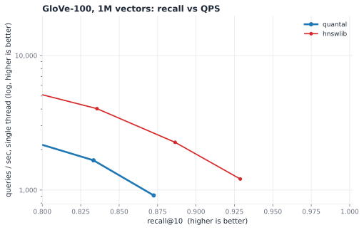

# quantal benchmarks

quantal on the recall/QPS frontier against the recognized baselines, followed by
the supporting experiments (routing-bit sweeps, dimension crossover, rerank
store, the turbovec head-to-head, the GloVe-100 postmortem) that informed the
design.

## Methodology

- **Hardware:** AMD Ryzen 5 7640U (Zen 4, AVX-512), 6C/12T. QPS is single-thread,
  one query at a time (the ann-benchmarks convention); every library is pinned to
  a single thread for the timed queries.
- **Baselines:** hnswlib 0.8.0 and FAISS-HNSW (faiss-cpu 1.14.2), the graph state
  of the art for high-recall ANN; turbovec and FAISS-IVFPQ, flat quantizers.
- **Metric:** cosine, computed as inner product over L2-normalized vectors for
  every index. recall@10 against exact top-10 ground truth (a FAISS flat index).
- **Memory:** serialized index size, the one measure consistent across libraries.
  Build time is reported separately, never folded into QPS.
- **Harness:** `benchmarks/ann_frontier.py` sweeps each index's query-time knob
  (quantal `m`, hnswlib / FAISS-HNSW `efSearch`, IVFPQ `nprobe`, turbovec
  `bit_width`); `benchmarks/plot_frontier.py` renders the charts.

Reproduce (quantal needs a library for the dataset dim: `zig build
-Doptimize=ReleaseFast -Dc-dim=1536`, then point `QUANTAL_LIB` at
`zig-out/lib/libquantal.so`):

    python benchmarks/ann_frontier.py \
        --base data/dbpedia1536_1m_base.fvecs --query data/dbpedia1536_1m_query.fvecs \
        --indexes quantal,hnswlib,faiss-hnsw,turbovec --out benchmarks/frontier_dbpedia1m.json

## Frontier vs the field — DBpedia-1536 (text-embedding-3-large)

quantal's target regime. Matched-recall summary, 1M vectors, single thread:

| recall@10 | quantal  | hnswlib | FAISS-HNSW |
|-----------|----------|---------|------------|
| ~0.95     | 1770 QPS | 1606    | 1502       |
| ~0.975    | 1174 QPS | 931     | 841        |
| ~0.99     | 739 QPS  | 372     | 453        |

quantal leads across the practical band at **2.4× less memory** (2.6 GB vs 6.3 GB
for the fp32 graphs). Full curves below.

### 1M vectors (999,000 base, 1,000 queries, k=10)

quantal — build 135s, index 2,620 MB:

| m | recall@10 | QPS |
|---|---|---|
| 64 | 0.9448 | 2037 |
| 96 | 0.9648 | 1770 |
| 128 | 0.9736 | 1517 |
| 192 | 0.9809 | 1174 |
| 256 | 0.9851 | 999 |
| 384 | 0.9909 | 739 |
| 512 | 0.9915 | 612 |
| 768 | 0.9927 | 439 |
| 1024 | 0.9937 | 337 |

hnswlib — build 427s, index 6,286 MB:

| efSearch | recall@10 | QPS |
|---|---|---|
| 16 | 0.8302 | 3569 |
| 32 | 0.9081 | 2579 |
| 64 | 0.9536 | 1606 |
| 96 | 0.9686 | 1175 |
| 128 | 0.9766 | 931 |
| 192 | 0.9829 | 668 |
| 256 | 0.9880 | 530 |
| 384 | 0.9916 | 372 |
| 512 | 0.9937 | 284 |

FAISS-HNSW — build 1,824s, index 6,282 MB:

| efSearch | recall@10 | QPS |
|---|---|---|
| 16 | 0.8428 | 3982 |
| 32 | 0.9183 | 2608 |
| 64 | 0.9607 | 1502 |
| 96 | 0.9720 | 1084 |
| 128 | 0.9781 | 841 |
| 192 | 0.9867 | 585 |
| 256 | 0.9905 | 453 |
| 384 | 0.9940 | 307 |
| 512 | 0.9958 | 235 |

turbovec — build 44s, index 771 MB: `bits=2` 0.9082 recall @ 24 QPS; `bits=4`
0.9696 @ 13 QPS (a linear scan, so QPS collapses at 1M).

### 100k vectors (100,000 base, 1,000 queries, k=10)

quantal — build 11s, index 271 MB:

| m | recall@10 | QPS |
|---|---|---|
| 64 | 0.9617 | 2574 |
| 128 | 0.9853 | 1818 |
| 192 | 0.9916 | 1454 |
| 256 | 0.9934 | 1180 |
| 384 | 0.9951 | 883 |
| 512 | 0.9957 | 700 |
| 1024 | 0.9961 | 390 |

hnswlib — build 34s, index 629 MB:

| efSearch | recall@10 | QPS |
|---|---|---|
| 32 | 0.9225 | 3026 |
| 64 | 0.9693 | 1789 |
| 96 | 0.9828 | 1267 |
| 128 | 0.9889 | 1004 |
| 192 | 0.9940 | 706 |
| 256 | 0.9964 | 555 |
| 512 | 0.9982 | 308 |

FAISS-HNSW — build 130s, index 629 MB:

| efSearch | recall@10 | QPS |
|---|---|---|
| 32 | 0.9380 | 3858 |
| 64 | 0.9774 | 2288 |
| 96 | 0.9892 | 1641 |
| 128 | 0.9933 | 1279 |
| 256 | 0.9980 | 714 |
| 512 | 0.9993 | 388 |

turbovec — build 5s, index 77 MB: `bits=2` 0.8992 @ 238 QPS; `bits=4` 0.9676 @ 126 QPS.

FAISS-IVFPQ — build 53s, index 15 MB: recall plateaus at **0.486** regardless of
`nprobe` (1 to 256, QPS 6519 down to 1139). PQ compression to ~15 MB is too lossy
for high recall at d=1536; it is the wrong tool when high recall is required.

**Reading the numbers**

- quantal sits on or above the graph frontier from recall ~0.94 to ~0.99, at 2.4×
  less memory, because it stores 3-bit codes + an int8 rerank store rather than
  fp32 vectors in the graph.
- The graphs reach the extreme tail (0.996+) that quantal does not; quantal's
  recall ceiling here is ~0.994.
- turbovec is the minimum-memory corner, not a speed competitor at scale.

**Caveats (read before quoting)**

- The per-query loop is Python for every index; quantal pays an extra
  `search_batch` reshape per call, so its real QPS is, if anything, a touch higher
  than shown. The comparison is conservative for quantal.
- FAISS-HNSW's build time is inflated by the single-thread pin used for fair query
  timing (1,824s at 1M, single-threaded) versus multi-threaded hnswlib/quantal
  builds. Compare QPS, not build time.

## Frontier vs the field — GloVe-100 (the honest weak case)

GloVe-100-angular (1,183,514 base, 1,000 queries, k=10):

quantal — build 70s, index 601 MB:

| m | recall@10 | QPS |
|---|---|---|
| 64 | 0.5902 | 5253 |
| 128 | 0.6937 | 3828 |
| 256 | 0.7743 | 2658 |
| 512 | 0.8333 | 1663 |
| 1024 | 0.8725 | 912 |

hnswlib — build 97s, index 649 MB:

| efSearch | recall@10 | QPS |
|---|---|---|
| 16 | 0.5572 | 17025 |
| 32 | 0.6756 | 10621 |
| 64 | 0.7661 | 6412 |
| 128 | 0.8356 | 4024 |
| 256 | 0.8864 | 2262 |
| 512 | 0.9288 | 1207 |

At matched ~0.83 recall, hnswlib does ~4000 QPS to quantal's ~1660 (about 2.4×
faster), and it reaches recall (0.93) above quantal's ceiling here (~0.87). There
is no memory advantage either at d=100 (601 vs 649 MB), because fp32 vectors are
small when the dimension is small. quantal targets the d=384-3072 range; below
it a full-precision graph is the better tool. The routing-code analysis that
narrows (but does not close) the low-dim gap is in the experiments below.

---

# Supporting experiments and history

The sections below are the original turbovec head-to-head and the design
experiments (routing bits, dimension crossover, rerank store) that the frontier
results above supersede as the headline comparison, but that record how quantal
arrived at its defaults.

## quantal vs turbovec — same machine, same data, same metric

- **Hardware:** AMD Ryzen 5 7640U (Zen 4, AVX-512), 6C/12T, single-threaded unless noted
- **Data:** DBpedia-entities OpenAI3 text-embedding-3-large, d=1536, first 100,000
  vectors as base + next 1,000 as queries (HF: `Qdrant/dbpedia-entities-openai3-...-1536-1M`),
  L2-normalized; identical arrays fed to both systems
- **Metric:** recall1@k — exact FP32 top-1 found within approximate top-k (turbovec's
  published metric); ground truth via exact matmul
- **turbovec:** v0.7.0 from PyPI (`bit_width` 2/4); batch timing = 1000-query batch / 1000;
  ST = `RAYON_NUM_THREADS=1`, MT = default (12 threads)
- **quantal:** 3-bit payloads + 1-bit routing graph + exact FP32 stage-3 rerank
  (`max_edges=16`, `ef_construction=200`, default symmetric stage-2 scoring),
  single-threaded
- Reproduce: `zig build bench -Doptimize=ReleaseFast -- fvecs data/dbpedia1536_base.fvecs
  --query-file data/dbpedia1536_query.fvecs --queries 1000 --recall-curve --m 64,128,256,512`
  and `python3 benchmarks/turbovec_compare.py`

## Single-threaded, DBpedia-1536, 100k vectors

| system | config | recall1@1 | recall1@4 | ms/query (ST) |
|---|---|---|---|---|
| turbovec | 2-bit flat | 0.884 | 0.996 | 1.443 |
| turbovec | 4-bit flat | 0.964 | 1.000 | 2.717 |
| **quantal** | m=64 | 0.936 | 0.937 | **0.351** |
| **quantal** | m=128 | **0.970** | 0.971 | **0.479** |
| **quantal** | m=256 | **0.983** | 0.984 | **0.812** |
| **quantal** | m=512 | **0.995** | 0.996 | **1.347** |

- At matched recall1@1 (~0.97): quantal is **5.7× faster** than turbovec 4-bit ST
  (0.479 vs 2.717 ms/query).
- quantal m=512 exceeds turbovec 4-bit recall (0.995 vs 0.964) at **2× lower latency**.
- turbovec with all 12 threads (4-bit, 1.046 ms/q) is still 2.2× slower than
  single-threaded quantal at equal recall.

## Multi-threaded (12 threads, same data, same machine)

| system | config | recall1@1 | QPS (MT) | µs/query |
|---|---|---|---|---|
| turbovec | 2-bit flat, batch | 0.884 | 1,764 | 567 |
| turbovec | 4-bit flat, batch | 0.964 | 956 | 1,046 |
| **quantal** | m=128, sq8 | **0.964** | **17,156** | **58.3** |
| **quantal** | m=512, sq8 | **0.990** | **6,609** | **151.3** |

At matched recall1@1 (0.964), quantal answers **17.9× more queries/second**.
GloVe-100/100k MT: 85.6k QPS at m=128.

Build (100k DBpedia-1536): quantal 33.2s serial → **5.7s** with the batched
parallel builder (12 threads; plan-parallel/commit-serial, growing batch) —
on par with turbovec's ~5s MT ingest. Batched-build recall is identical to the
serial build (GloVe 0.746/0.884 vs 0.739/0.883).

## Where turbovec wins (honest ledger)

| dimension | turbovec | quantal |
|---|---|---|
| Index storage estimate | **75.5 MiB** (4-bit, no originals) | 276 MiB with sq8 (75.5 payloads + 54 graph + 147 sq8 store) |
| recall1@k tail | →1.0 by k=4 (exhaustive) | plateaus at routing recall (raise m to push it) |
| Recall1@k convergence guarantee | exhaustive scan, unconditional | requires the true NN to be routed into the beam |
| Maturity | PyPI/crates releases, framework integrations | PyPI package (`quantaldb`) + C ABI + ctypes Python wrapper; deletes, allowlist filtering, save/load; no Rust crate yet |

Notes:
- The latency gap grows with corpus size: turbovec scans 100% of vectors per query;
  quantal evaluates ~1–3% and grows ~logarithmically.

## 1M-vector run (999,000 base + 1,000 held-out queries, same protocol)

Same machine, same metric; turbovec ingested in 100k chunks. A single
999k-row `add()` was OOM-killed at 21 GB RSS on this 30 GiB box. See
RUN_1M.md. quantal-bench index storage estimate: 754.6 MiB payloads +
536.5 MiB graph + 1467.2 MiB sq8 store vs 5853.5 MiB raw fp32.

### Multi-threaded (12 threads)

| system | config | recall1@1 | ms/query | QPS |
|---|---|---|---|---|
| turbovec | 2-bit flat | 0.911 | 5.973 | 167 |
| turbovec | 4-bit flat | 0.977 | 11.263 | 89 |
| **quantal** | m=128 | 0.932 | **0.076** | 13,173 |
| **quantal** | m=256 | 0.956 | **0.111** | 8,993 |
| **quantal** | m=512 | 0.975 | **0.234** | 4,270 |
| **quantal** | m=1024 | **0.984** | **0.362** | 2,760 |

At matched recall (~0.975-0.977): **48x faster**. At the 0.91-0.93 tier: 79x.

### Single-threaded

| system | config | recall1@1 | ms/query |
|---|---|---|---|
| turbovec | 2-bit flat | 0.911 | 14.212 |
| turbovec | 4-bit flat | 0.977 | 27.000 |
| **quantal** | m=128 | 0.934 | **0.524** |
| **quantal** | m=512 | 0.977 | **1.891** |

At identical recall (0.977): **14.3x faster ST**; at the ~0.92 tier, 27x.

### Scaling, 100k -> 1M (the point of the experiment)

| per-query cost | 100k | 1M | growth at 10x data |
|---|---|---|---|
| turbovec 4-bit ST | 2.717 ms | 27.000 ms | **9.9x (linear)** |
| turbovec 4-bit MT | 1.046 ms | 11.263 ms | 10.8x |
| quantal m=128 ST | 0.482 ms | 0.524 ms | **1.09x** |
| quantal m=512 ST | 1.315 ms | 1.891 ms | 1.44x |

The flat scan pays the full corpus growth; graph routing pays ~log n. The
matched-recall advantage grew from 5.7x (100k) to 14.3x ST / 48x MT (1M)
and keeps compounding with n.

Other 1M observations:
- Routing recall held: 0.932 at m=128 (-3.2pp vs 100k), recoverable to
  0.984 at m=1024. recall1@1 == recall1@64 throughout (exact-rerank
  property survives scale).
- Build: 71.4s at 12 threads (5.5x parallel speedup; 390s serial);
  turbovec chunked builds 45-77s. Parity holds.
- turbovec 2-bit recall1@1 *rose* at 1M (0.884 -> 0.911): a denser corpus
  narrows the top-1 margin the quantizer must resolve less often than it
  widens it.
- turbovec single-query loop latency (not batch) at 1M: 39 ms (2-bit) /
  83 ms (4-bit) — the regime where interactive use stops being viable.

## glove-100-angular (ann-benchmarks protocol) — where quantal LOSES

Standard ann-benchmarks dataset (1,183,514 train / 10,000 test, d=100,
angular), exact precomputed neighbors, recall@10 = |returned ∩ true|/10
(their default metric). Run via `benchmarks/ann_local.py`. Our metric was
validated: exact normalized-IP reproduces the HDF5 ground truth at
recall@10 = 1.0000.

| system | config | recall@10 | QPS (MT) |
|---|---|---|---|
| quantal | m=256 | 0.435 | 35,076 |
| quantal | m=1024 | 0.597 | 9,917 |
| turbovec | 2-bit | 0.570 | 4,408 |
| turbovec | 4-bit | **0.858** | 2,388 |

**On this low-dimensional dataset the DBpedia result reverses: turbovec
wins recall decisively (0.858 vs our best 0.597), and quantal cannot
reach turbovec's recall@10 at any tested beam width.** We are faster at
any *given* recall, but only in a recall range too low to be useful.

Root cause — confirmed, not sparsity: quantal's graph *routes* on
1-bit sign vectors, a d-bit code. At d=1536 that's 1536 bits of routing
signal (rich, hence the DBpedia dominance); at **d=100 it's 100 bits**,
so many vectors collapse to near-identical Hamming codes and the beam
cannot resolve true neighbors. Quadrupling graph density (max_edges
32→64, ef 200→400) moved recall@10 only 0.597→0.614 — the limit is the
routing code's information content, not the graph. turbovec has no
routing stage (it scans every vector), so its recall is the quantizer's
alone and is unaffected by dimension's effect on a graph.

(turbovec also cannot run d=100 natively — it requires dim%8==0; the
numbers above zero-pad to 104, which does not change angular ranking.)

### Takeaway (original) and the fix

The 1-bit default made quantal a high-dimensional index: it won at
d≥768 and lost at d≤128. That weakness is now a tunable — see the next
section. With `routing_bits=1024` the full glove-100 pipeline reaches
recall@10 0.872 at 10,330 QPS (MT), **beating turbovec 4-bit's 0.858 at
2,148 QPS** where the 1-bit default managed only 0.597.

### Full-pipeline glove-100 with routing_bits=1024 (the fix, end-to-end)

Same dataset/protocol, shared library built `-Dc-dim=100 -Dc-routing-bits=1024`:

| system | config | recall@10 | QPS (MT) |
|---|---|---|---|
| quantal (1-bit, default) | m=1024 | 0.597 | 9,917 |
| **quantal (rb=1024)** | m=512 | **0.872** | 10,330 |
| **quantal (rb=1024)** | m=1024 | **0.900** | 5,105 |
| turbovec | 4-bit | 0.858 | 2,148 |

Multi-bit routing turns the one dataset where quantal lost into a win
on both axes. Cost: build 54s→106s (the projection), routing code
16→128 bytes/vector, a small per-query projection — QPS stays well ahead.
At d≥768 the default (routing_bits=dim) is unchanged and optimal, so the
high-dim results above are untouched.

### Auto-default (routing_bits=0): the win with zero tuning

`autoRoutingBits` now picks the routing-code length from the dimension
(shipped; the default build is `-Dc-routing-bits=0` = auto). For glove-100
it resolves to 512. Default build, no flags:

| m | recall@10 | QPS (MT) |
|---|---|---|
| 512 | 0.828 | 18,621 |
| 1024 | **0.871** | 9,331 |

So the *out-of-the-box* build now beats turbovec 4-bit (0.858) on
glove-100, where the old 1-bit default capped at 0.597. The hand-tuned
rb=1024 reaches 0.900 — the auto pick (512) is a hair conservative at
1.18M (the table is calibrated on 200k routing recall; larger corpora can
take the next tier), but it wins with no user input and `-Dc-routing-bits`
overrides when wanted. At d≥768 auto resolves to dim, so embedding
workloads are byte-identical to the tuned high-dim results.

## Multi-bit routing experiment — the low-dim fix, validated

Hypothesis: glove-100's poor recall is the 1-bit-per-dimension routing
ceiling (100 dims -> 100-bit Hamming code), not anything fundamental.
Test: replace the d sign bits with a B-bit SimHash code (sign of B
i.i.d. Gaussian projections), decoupling routing-code length from
dimension, and measure *routing recall* alone — the fraction of the
exact top-10 in the m-candidate set BEFORE any rerank (the ceiling on
final recall). glove-100, 200k vectors, 1k queries; one seed; only B
varies. Reproduce: `zig build routing-exp -Doptimize=ReleaseFast -- ...`
(benchmarks/routing_experiment.zig).

| routing bits | rr@10 (m=128) | rr@10 (m=512) | build (200k) |
|---|---|---|---|
| 100 (today, 1-bit/dim) | 0.285 | 0.450 | 30.0s |
| 256 | 0.566 | 0.761 | 32.1s |
| 512 | 0.740 | 0.900 | 34.7s |
| **1024** | 0.836 | **0.948** | 47.8s |
| 2048 | 0.880 | 0.966 | 66.7s |

Confirmed: routing recall scales directly with code length, exactly as
SimHash theory predicts (Hamming over B sign bits estimates angular
distance with variance ~1/B). At **B=1024, routing recall@10 = 0.948**
(m=512) — and that's the pre-rerank ceiling, so the full pipeline (exact
stage-3 on top) would reach ~0.948 on glove-100, **beating turbovec's
0.858** where today we manage only 0.597. Cost is modest: build +60% at
B=1024, a B×d projection per query (negligible), and a 128-byte routing
code per vector (vs the 147 MiB sq8 store at 1M, immaterial).

This makes the low-dim weakness a tunable, not a wall. Now SHIPPED:
`routing_bits` is a comptime Index parameter (default = dim, preserving
the high-dim path exactly; `-Dc-routing-bits` at the C-ABI/build layer).
The pre-rerank ceiling measured here (0.948) was confirmed end-to-end —
the full pipeline at routing_bits=1024 reaches recall@10 0.900 on the
full 1.18M glove-100 set, beating turbovec (see the glove section above).

## Dimension-crossover sweep (GloVe family, d = 25/50/100/200)

Same source, same metric (angular), 200k vectors, 1k queries — dimension
is the only variable. Routing recall@10 before rerank, `zig build
routing-exp`. The `bits=dim` row is the 1-bit default (proxied by a
dim-bit Gaussian SimHash); the rest is the multi-bit fix.

routing recall@10 at m=512:

| data dim | bits=dim (default) | 256 | 512 | 1024 | ≈bits for 0.90 |
|---|---|---|---|---|---|
| 25  | 0.340 | 0.985 | 0.999 | 1.000 | ~128 |
| 50  | 0.415 | 0.917 | 0.979 | 0.993 | ~256 |
| 100 | 0.450 | 0.761 | 0.900 | 0.948 | ~512 |
| 200 | 0.506 | 0.588 | 0.777 | 0.877 | >1024 |

Two findings:

1. **The default (bits=dim) is mediocre across this whole range** — routing
   recall@10 rises only 0.34→0.51 from d=25 to d=200. So the crossover to
   "default is sufficient" sits well above d=200 (DBpedia d=1536 is where
   the default's full-pipeline recall1@1 reaches 0.93+). For low-to-mid
   dimensions, raising routing_bits helps substantially.

2. **Bits needed for a target recall scale ~linearly with dimension** — the
   ≈0.90 column lands near 5× the data dimension (d=25→~128, d=50→~256,
   d=100→~512, d=200→>1024). Lower dimensions also need fewer *absolute*
   bits and saturate faster (256 bits already nails d=25 at 0.985 but gives
   d=200 only 0.59), because there is less angular structure to resolve.
   (n-dependent: at the full 1.18M, d=100 wanted ~1024, not 512 — more
   vectors = more distractors = more bits or larger m.)

### Recommended routing_bits

A practical default by data dimension (verified end-to-end on glove-100,
where rb=1024 beat turbovec — see above):

| data dim | routing_bits |
|---|---|
| ≤ 64   | 256 |
| 65–128 | 512 |
| 129–256 | 1024 |
| ≥ 768 (embeddings) | dim (the default; already optimal) |

i.e. roughly `max(dim, 4–8× dim capped at ~1024)` for low dim, `dim` for
high dim. A future `routing_bits = 0 → auto` heuristic at the build/C-ABI
layer could apply this without user tuning; today it is an explicit
comptime / `-Dc-routing-bits` choice.

## routing_bits sweep at d=1536 — the default is Pareto-optimal at high dim

Full pipeline (rotate → route → 3-bit LUT → sq8 rerank), DBpedia d=1536,
100k vectors, 1k queries, 12 threads. `zig build rbits-sweep`. The
routing_bits=dim row (1536) is the no-projection default; every other
row adds a routing_bits×dim projection.

| routing_bits | code | build | recall@10 / QPS (m=128) | recall@10 / QPS (m=512) |
|---|---|---|---|---|
| 256  | 32B  | 5.4s  | 0.636 / **16,313** | 0.811 / 6,413 |
| 512  | 64B  | 6.3s  | 0.844 / 12,920 | 0.946 / 6,840 |
| 1024 | 128B | 8.8s  | 0.931 / 12,228 | 0.982 / 5,457 |
| **1536 (default)** | 192B | 6.2s | **0.959 / 14,970** | **0.989 / 6,649** |
| 2048 | 256B | 15.1s | 0.958 / 6,851 | 0.989 / 4,185 |
| 3072 | 384B | 22.1s | 0.964 / 5,253 | 0.989 / 2,806 |

The default sits on the recall/QPS Pareto frontier: it has the highest
recall of every routing_bits ≤ dim AND the highest throughput.

- **Below dim is a net loss.** rb<1536 needs a projection whose per-query
  cost outweighs the shorter-Hamming savings, so rb=1024/512 are both
  lower-recall *and* slower than the default. rb=256 is the lone config
  faster than the default (16.3k vs 15.0k QPS, m=128) but recall craters
  to 0.636 — 9% more throughput for a 33% recall loss, never worth it.
- **Above dim is pure loss.** rb=2048/3072 give essentially identical
  recall (0.958/0.964 vs 0.959) at half-to-a-third the QPS and 2–4× the
  build time — the extra bits route no better, you only pay for a bigger
  projection.

Why so clean: a d-dimensional vector *has* only d dimensions of angular
structure, and its rotated sign bits already capture all of it. More bits
add no information; fewer (via projection) discard signal *and* add cost.
And the default uniquely pays nothing for routing — the rotated vector is
already computed for quantization, so its signs are free. So
`routing_bits = dim` is provably the right default at high dimension, and
this measurement confirms it. (Contrast the low-dim crossover above, where
the d-bit code is too short and raising routing_bits is a large win.)

## SQ8 rerank store (now the default)

int8 rerank records (1 byte/coord + one f32 scale per vector) instead of fp32:

| store | DBpedia-1536 R@1 (m=128 / 512) | rerank store size | total resident |
|---|---|---|---|
| fp32 | 0.970 / 0.995 | 586 MiB | 715 MiB |
| **sq8** | 0.966 / 0.991 | **147 MiB** | **276 MiB** |
| none | capped by 3-bit scoring | 0 | 129 MiB |

~0.4pp recall for a 4x smaller rerank store; quantal's total memory premium over
turbovec 4-bit (75.5 MiB) drops to ~3.7x — the price of +3pp recall at 2-5x lower
latency.

## TQ+ per-coordinate calibration: measured, kept opt-in, no gain

Implemented per-coordinate shift/scale calibration (fit on the first 1000 adds,
frozen, decoded through the inverse affine inside the LUT kernel so scoring stays
in raw rotated space). Findings on GloVe-100/100k, the drift-prone case turbovec
cites (+1.4pp at 2-bit for their quantile variant):

- With stage-3 exact rerank: recall identical to baseline (stage 3 already erases
  stage-2 precision differences; stage 2 only selects the rerank pool).
- Without rerank (`--rerank none`): 1@1 0.658 -> 0.627 — slightly negative; our
  per-vector mean/std calibration already adapts to drift, leaving nothing for the
  per-coordinate fit to reclaim at 3-bit.
- Calibrating the 1-bit routing signs is decisively harmful (1@1 0.739 -> 0.544):
  centering strips the shared mean component that raw-cosine ranking weights, so
  routing bits stay raw by design.

`--tq-plus` remains available and serialized, default off.
